# Windows Server Active Directory Infrastructure — End-to-End Lab

**A hands-on infrastructure project by Olumide Akomolafe**
*Network Support Technician — Conestoga College (Cambridge, Ontario)*

In this lab I designed and built a complete Windows Server 2019 domain infrastructure from bare VMs — Active Directory Domain Services, DHCP, DNS with a CNAME alias, a secondary domain controller for redundancy, a tightly-scoped OU and group structure, a secured Purchasing file share, NTFS permissions enforcing least-privilege, and a Group Policy Object that drops a network drive on each user's desktop at login.

I'll walk you through every step below, with the screenshots I captured at each milestone.

---

## The case scenario I built this against

I treated this as a real engagement for a fictional client I'll call **Ridgemont Purchasing & Audit** — a small Cambridge-based consultancy with two teams:

- **Buyers** — three people who prepare budget documents for client RFP responses.
- **Analysts** — three people who write audit reports on those same engagements.

Today they share everything in one folder on a flat workgroup. That's the problem. Budgets shouldn't be visible to Analysts until they're posted; audits shouldn't be visible to Buyers until they're signed off. Buyers should only be able to *modify their own* budgets, not overwrite a colleague's. Same rule for Analysts on their audits. Administrators get full access; nobody else gets in.

My deliverable was a Windows Server 2019 domain that enforces all of that automatically — so a user doesn't have to remember the rules, the system remembers them.

---

## The infrastructure I built

| Role | Host | IP | Purpose |
|---|---|---|---|
| Primary domain controller | `DC1-FE` | `.10` | AD DS, DHCP, primary DNS |
| Secondary domain controller | `DC2-FE` | `.11` | AD replica, redundant DNS |
| File server | `FS-FE` | `.12` | Purchasing share with SMB encryption |
| Client workstation | `WIN10-FE` | DHCP-assigned | Domain-joined user PC |

The four VMs were provisioned on the ACSIT vSphere cluster---

## Stage 1 — Provisioning the VMs on vSphere

I provisioned four Windows VMs from the Windows Server 2019 / Windows 10 templates on vSphere, set each one's static IP at deployment time, and confirmed in the vSphere client that the hardware spec (CPU, memory, thin-provisioned disk) matched the build sheet for each role.

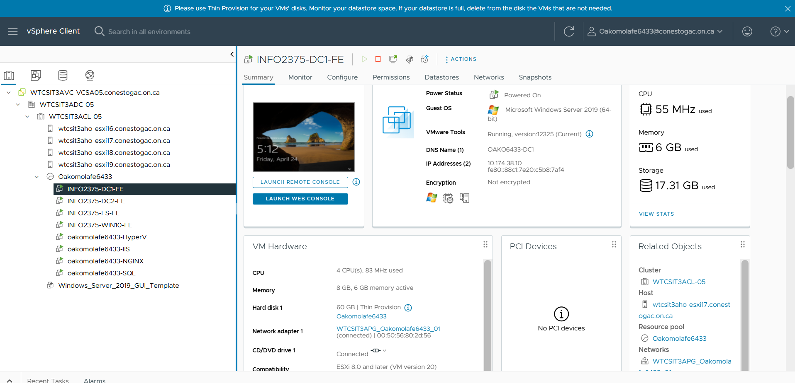
*Primary domain controller — DC1-FE, 4 vCPU, 70 GB thin-provisioned disk.*

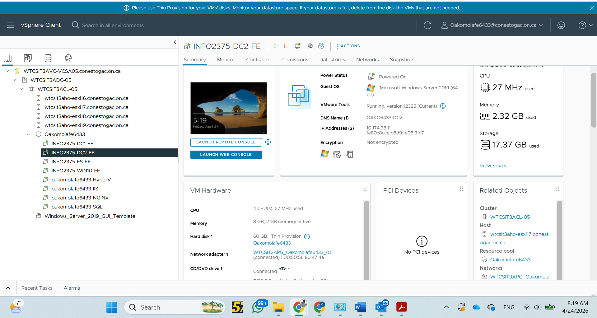
*Secondary domain controller — DC2-FE.*

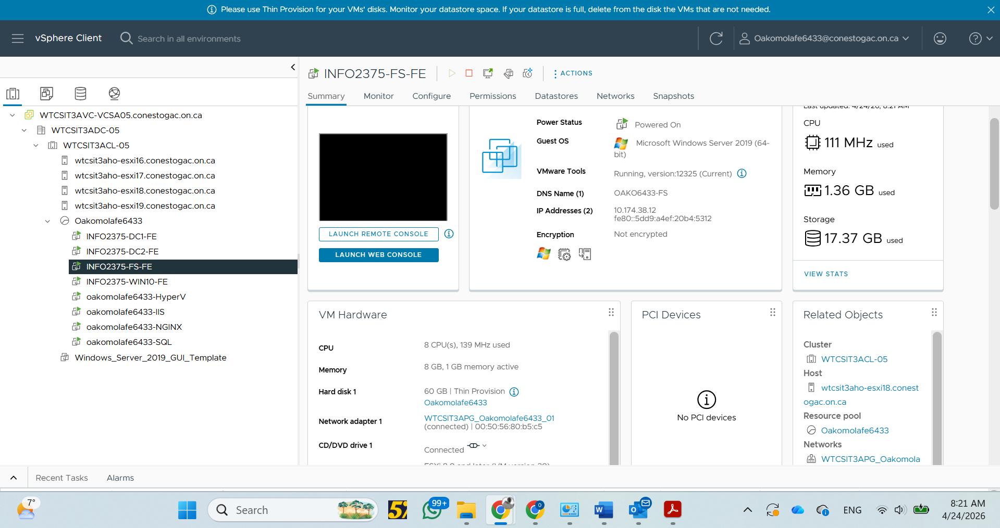
*File server — FS-FE, 60 GB thin-provisioned disk.*

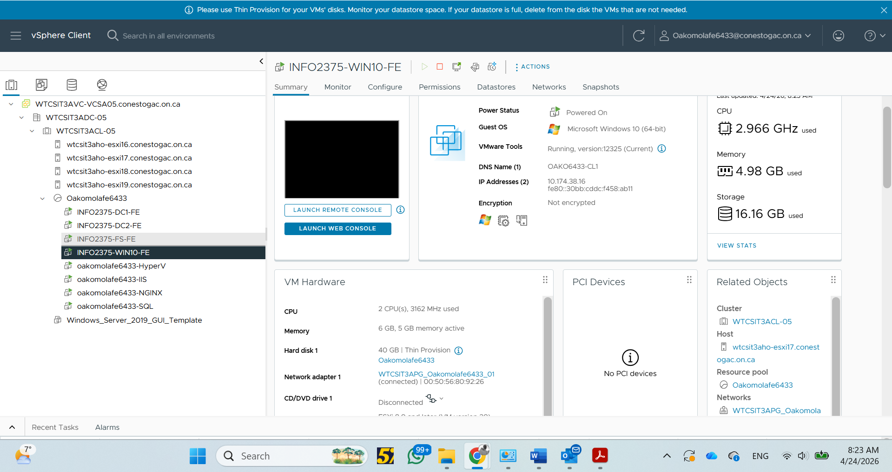
*Client workstation — WIN10-FE, the box that will eventually log in as Laura Oaks and Emma Enrique.*

**Why I did this first.** Naming and IP planning before any role install is non-negotiable. A static IP on DC1 is mandatory because the moment I promote it to a domain controller, every other machine on the network needs a fixed address to reach it for DNS resolution. Renaming a domain controller after the fact is messy; getting it right at provisioning takes thirty seconds.

---

## Stage 2 — Installing Active Directory and joining the domain

On DC1 I installed the **Active Directory Domain Services** role, promoted the server to a domain controller, and created a new forest with the domain name `6433-FINAL.corp`. I then joined the file server and the client workstation to the domain.

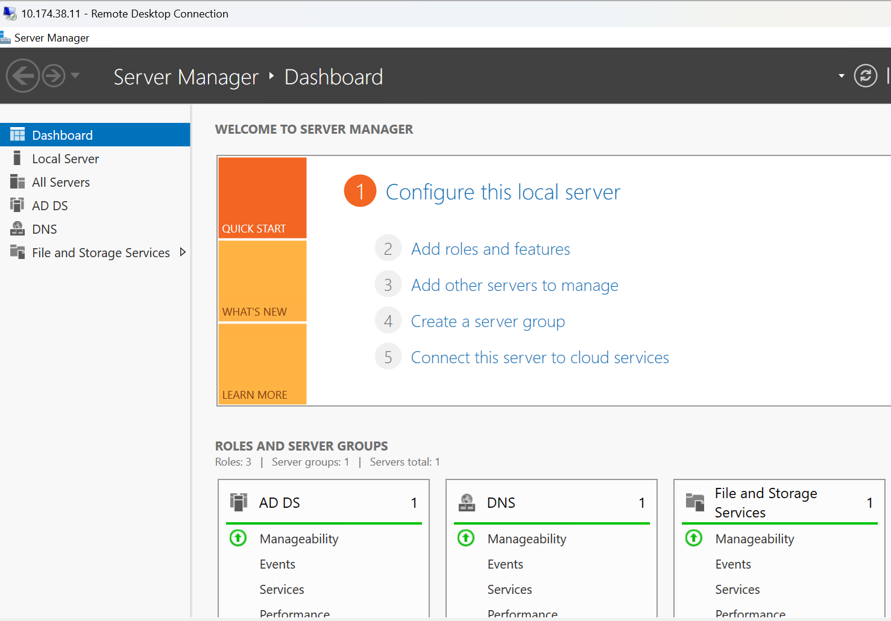
*The Active Directory Domain Services role installed on DC1 with the promotion wizard ready.*

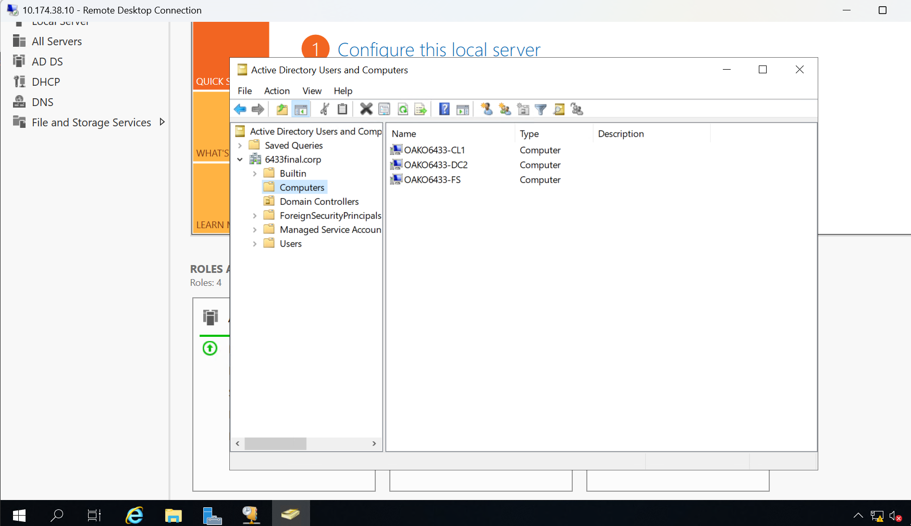
*Active Directory Users and Computers showing the domain-joined machines.*

**What I want to call out here.** Until DC1 was promoted, the other VMs didn't know what "the domain" was. The order matters: promote first, then point the other machines' DNS at DC1, *then* attempt the domain join. If you join before fixing DNS, the join fails with a "domain controller could not be located" error — which is one of the most common gotchas in a fresh lab and the first thing I'd check on a real ticket.

---

## Stage 3 — DHCP services on DC1

I installed the DHCP server role on DC1 and authorised it in the domain. I configured a scope on my assigned subnet using `.65` to `.69` as the host range, and I made sure the scope options included the default gateway, the domain controller as DNS, and the AD domain suffix. Without those three options a client gets an IP but cannot find the domain — same failure mode as Stage 2, just slower to notice.

I changed FS1 from static to DHCP so I could verify the scope was working, then switched it back to static once verified (servers shouldn't move addresses).

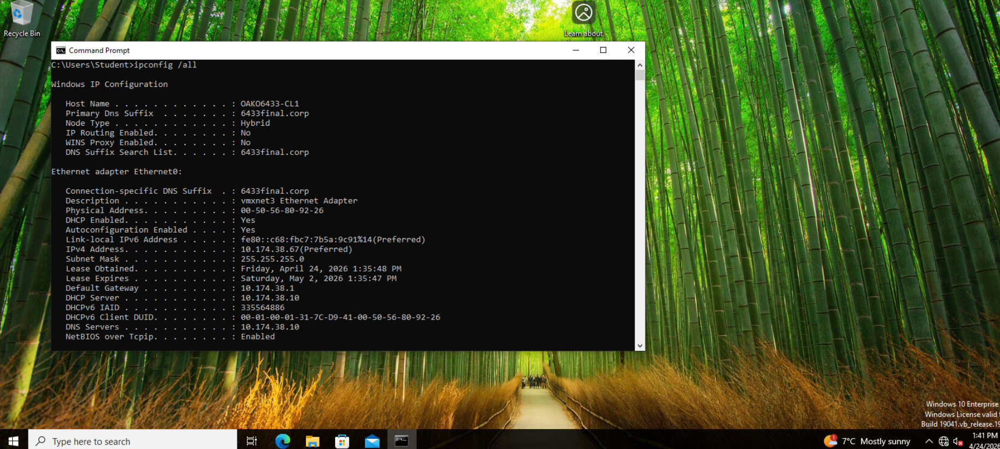
*`ipconfig /all` on the client showing a full DHCP-issued lease — IP, gateway, DNS, and the connection-specific DNS suffix all populated.*

**Why DNS suffix matters in DHCP.** A client with no domain suffix can still ping by IP, but `ping fs1` won't resolve to the file server — only `ping fs1.6433-FINAL.corp` will. Pushing the suffix via DHCP option 15 means users never have to type the FQDN.

---

## Stage 4 — Secondary domain controller and DNS redundancy

I promoted DC2 to a secondary domain controller in the same forest and configured DNS so that **DC2's preferred DNS points at DC1, and its alternate DNS points at itself** — and the mirror on DC1 (preferred = self, alternate = DC2). This is the canonical recipe for redundant AD DNS: each DC prefers its peer for normal lookups, so a single-DC outage doesn't take down the resolver, but each one can answer if the peer is unreachable.

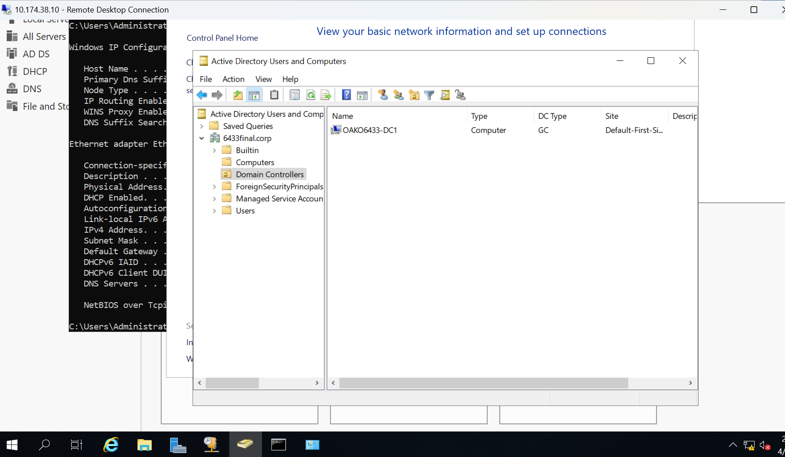
*DC2 successfully joined to DC1 as a secondary domain controller.*

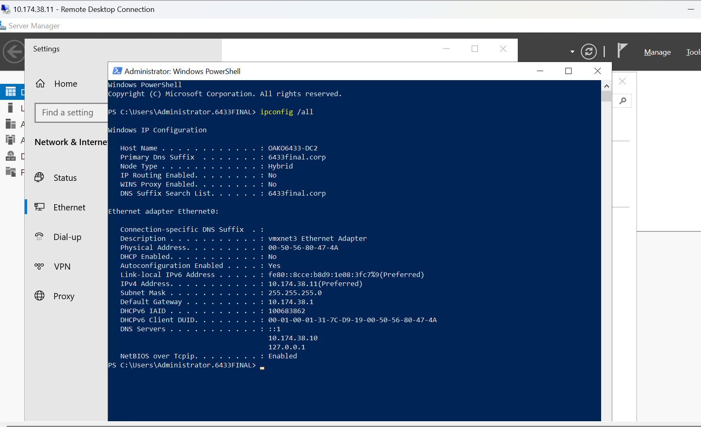
*On DC2: preferred DNS points to DC1's IP, alternate DNS points to itself.*

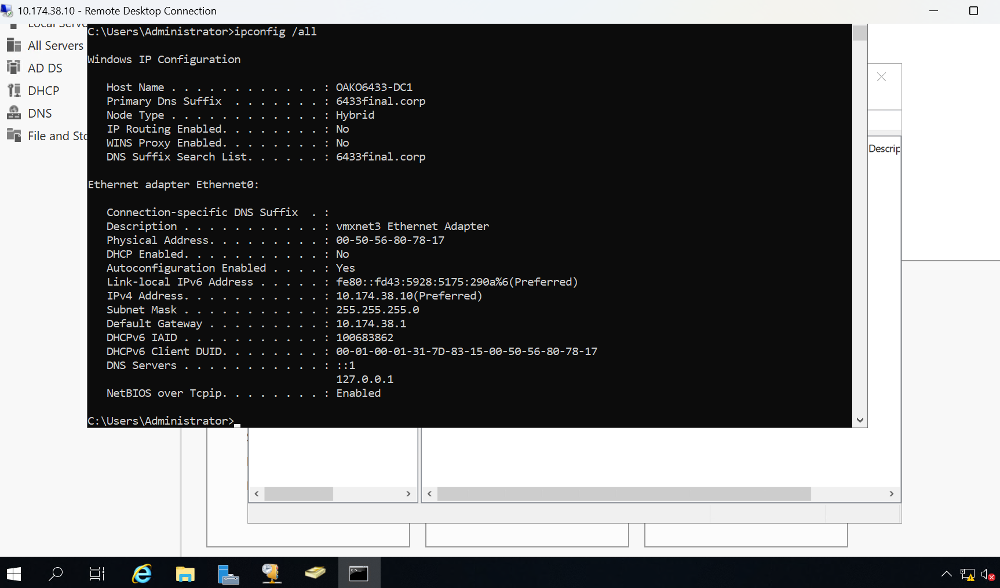
*On DC1: preferred DNS points to itself, alternate to DC2.*

**The principle behind the mirror.** If both DCs preferred *themselves*, replication conflicts can mask DNS data corruption — you'd see two DCs that "both work" but disagree about records. Pointing each DC at the other for the primary resolver means they're constantly cross-checking each other's view of the directory, and any divergence shows up immediately in the resolver, not weeks later.

---

## Stage 5 — Users, groups, and the OU structure

I built the OU tree under the domain following a function-first design: a top-level `HQ` OU with three sub-OUs — `Users`, `Endpoints`, `Servers`. I moved FS1 into `Servers` and CL1 into `Endpoints`, then created users and groups in `Users`.

I then created the groups Ridgemont actually needs:

- **`Buyers_6433`** — global security group, contains Laura Oaks.
- **`Analysts_6433`** — global security group, contains Emma Enrique.
- **`Budget_Writers_6433`** — domain-local resource group. `Buyers_6433` is nested inside it. *This* is the group that gets permissions on the Budget folder later.
- **`Audit_Writers_6433`** — domain-local resource group, with `Analysts_6433` nested inside.

This is **AGDLP** group nesting — Accounts go in Global groups by role, Global groups go in Domain Local groups by resource, Domain Local groups get the ACL. The reason matters: when the Analyst team gets a new hire, I add one user to one global group and they inherit every share, printer and policy that role uses. No file-level ACL changes, no exceptions.

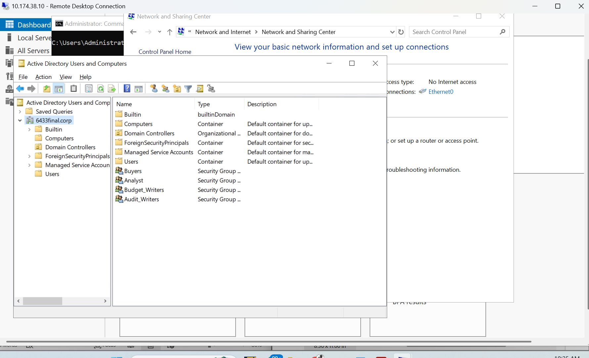
*All four security groups created in the Users OU.*

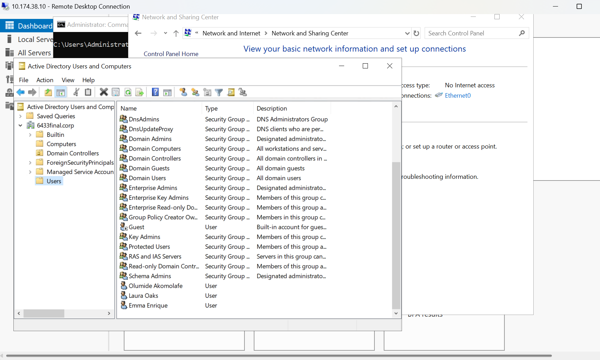
*Laura Oaks, Emma Enrique, and my own administrative account.*

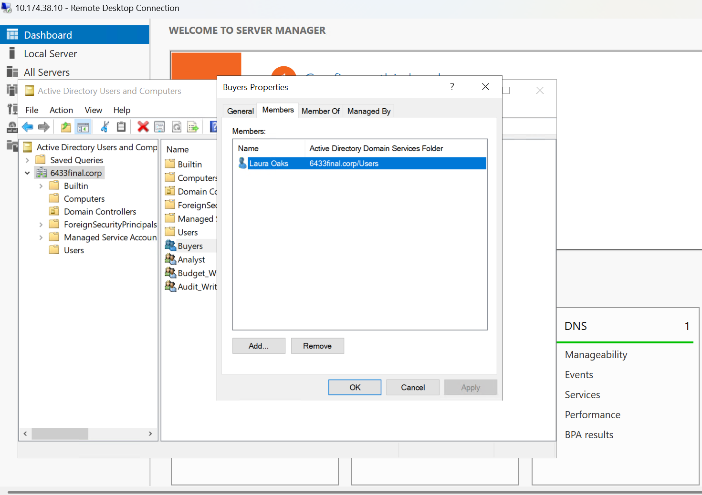
*Buyers_6433 — Laura Oaks is a member.*

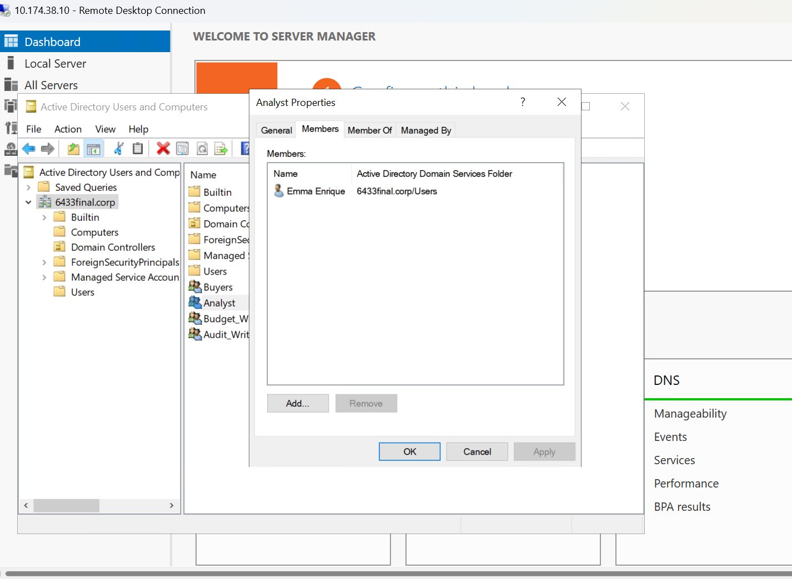
*Analysts_6433 — Emma Enrique is a member.*

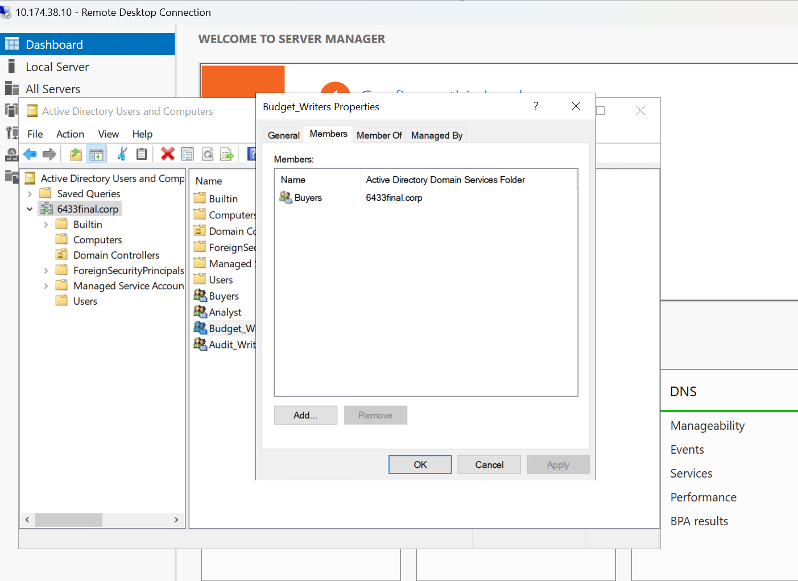
*Budget_Writers_6433 contains the Buyers_6433 global group, not Laura directly.*

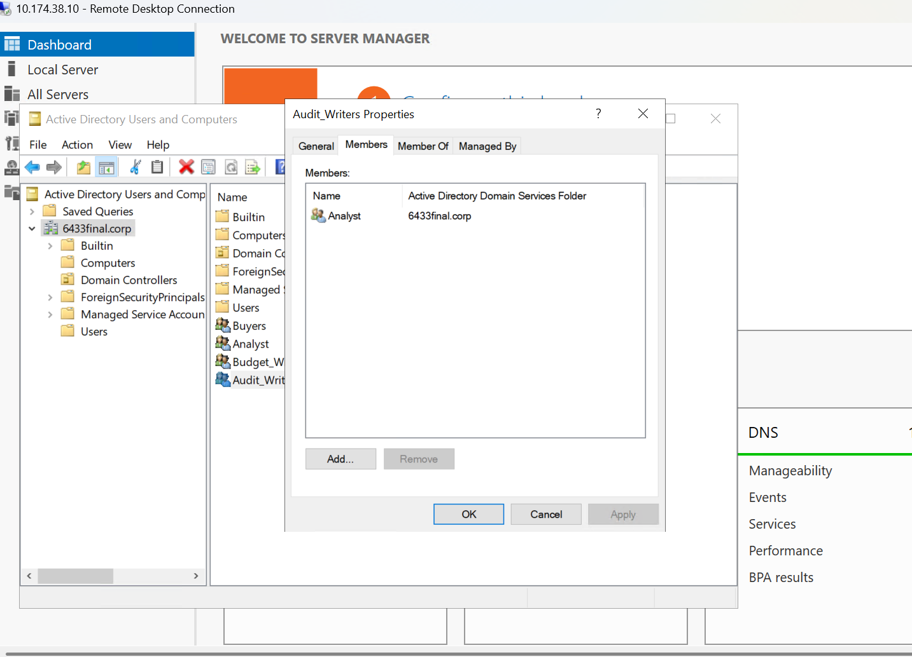
*Audit_Writers_6433 contains the Analysts_6433 global group.*

**The administrative account separation.** I used best practice — my day-to-day account does not have Domain Admin rights. I created a separate elevated account for domain administration. That way a phishing attack against my regular account can't promote into the directory.

---

## Stage 6 — The Purchasing file share

On FS1 I created the folder structure for the share:

```
D:\Shares\Purchasing\
├── Budget\        ← Buyers write here
└── Audit\         ← Analysts write here
```

I shared `Purchasing` using **best-practice share permissions** — the principle is to set share permissions wide (Authenticated Users — Modify) and let NTFS do the actual access control. Two layers, but only one of them is enforced — and NTFS is the one that follows the file. I also enabled **SMB encryption on the share**, so data in transit to and from the share is encrypted on the wire without needing a separate VPN.

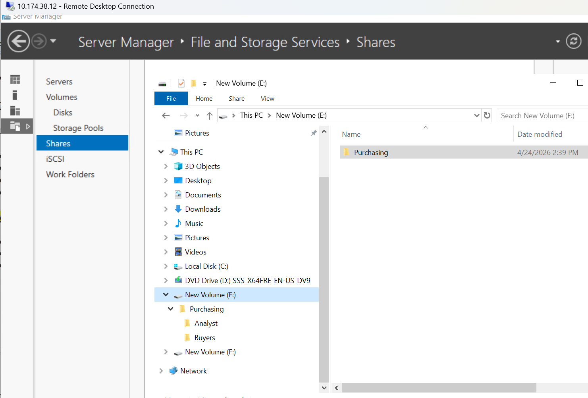
*The Budget and Audit folders under Purchasing on FS1.*

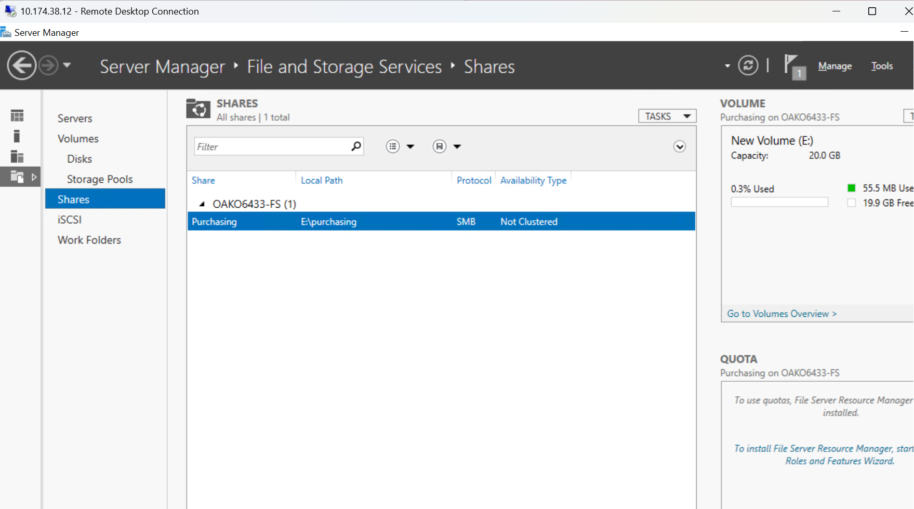
*The share visible in Server Manager → File and Storage Services, with encryption enabled.*

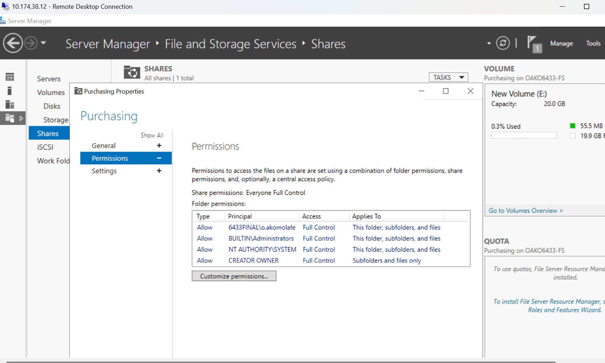
*The share permissions — wide and uniform, because NTFS does the enforcement.*

---

## Stage 7 — NTFS permissions enforcing least-privilege

This is the part that makes or breaks the design. I disabled inheritance on the Purchasing folder, removed the inherited entries, and then explicitly granted:

| Group | Budget folder | Audit folder |
|---|---|---|
| `Budget_Writers_6433` (Buyers) | List + Read all; Create files; Modify only their own | Read all |
| `Audit_Writers_6433` (Analysts) | Read all | List + Read all; Create files; Modify only their own |
| `Domain Admins` | Full Control | Full Control |
| `SYSTEM` | Full Control | Full Control |

The "modify only their own" rule uses the **CREATOR OWNER** built-in identity and the special permission *Write*, applied to "Subfolders and files only" — so when Laura creates a new budget document she becomes the owner, and her Modify permission flows automatically to *that file only*. She can't touch a budget her colleague wrote.

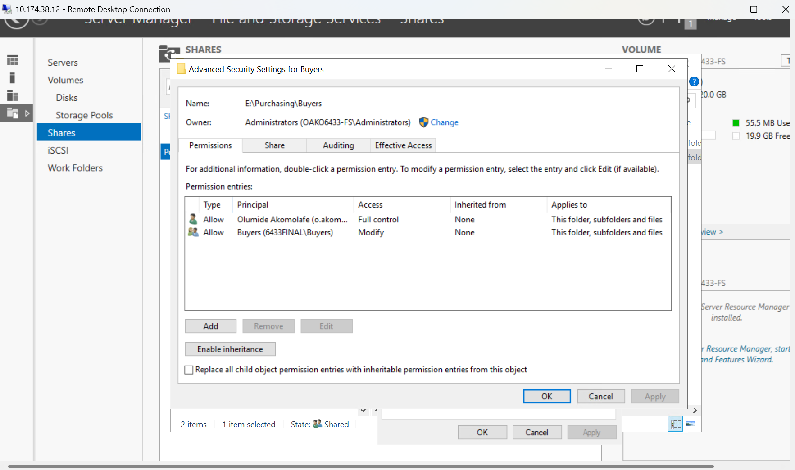
*Advanced security view showing the Buyers entries on the Budget folder — Read for the group, Modify scoped to CREATOR OWNER.*

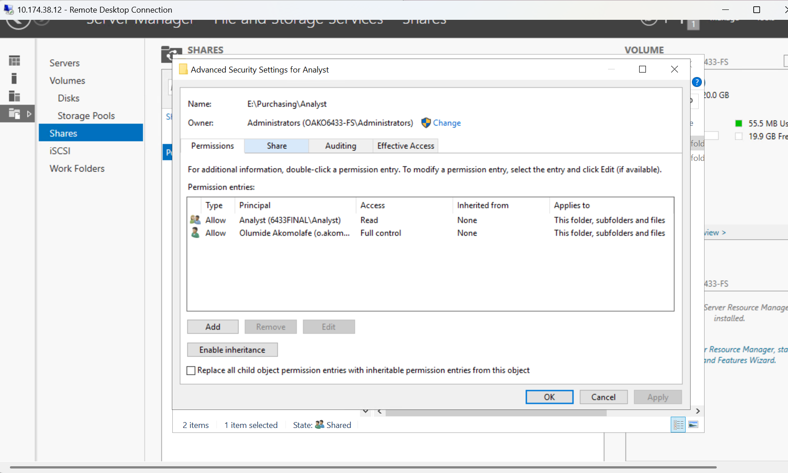
*Same pattern for Analysts on the Audit folder.*

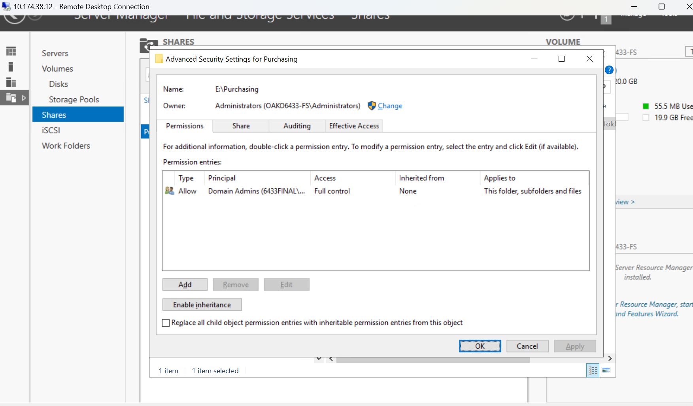
*Domain Admins retain Full Control on Purchasing — needed for backup, restore, and emergency access.*

**Why this is the interesting part.** A common mistake is to give a group "Modify" on a folder. That means *every member* can rewrite *every file*, even ones written by their colleagues — which silently breaks the "modify only your own" requirement. The CREATOR OWNER trick is the canonical Windows way to scope write-back to the author. It's the kind of thing a hiring manager will ask about, because the wrong answer ("just give them Modify") is the one most people give.

---

## Stage 8 — Group Policy: auto-mapped X: drive at login

I created two GPOs, one per team, linked to the appropriate scope, that drop a network drive at login: `X:\` mapped to `\\FS1\Purchasing\Budget` for Buyers, and `\\FS1\Purchasing\Audit` for Analysts. Each GPO uses **item-level targeting** on the security group, so even if a user account is moved between OUs the right drive shows up based on group membership rather than OU location.

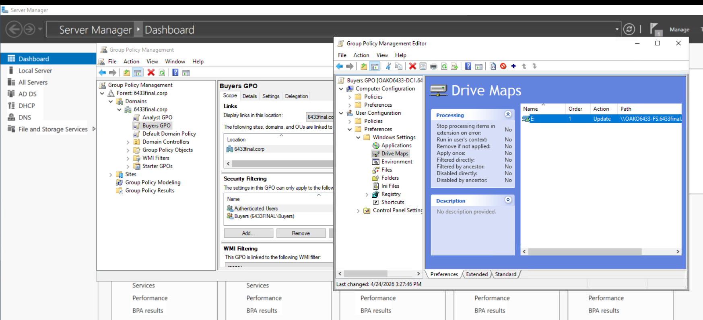
*The Buyers GPO showing the X: drive mapping action and the security-group filter.*

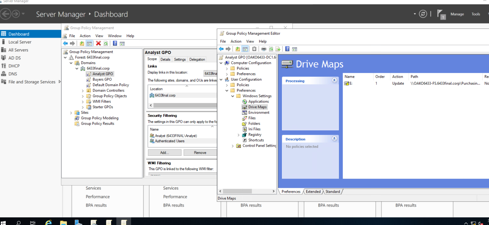
*The Analysts GPO with the same shape, pointing at the Audit folder.*

**Why GPO drive mapping, not a login script.** A login script runs at logon and that's the end of its visibility — if it errors, nobody sees it. A GPO preferences drive map is logged by Group Policy itself, shows up in `gpresult /r`, and can be filtered to a security group without scripting. Easier to support six months from now.

---

## Stage 9 — End-to-end verification

The proof: I logged into CL1 as Laura Oaks. The X: drive appeared automatically, pointed at the Budget folder. She could read both Budgets and Audits (Audits is read-only for her), create a new budget document, and modify it — but couldn't touch a budget her colleague had created. I then logged in as Emma Enrique. Same shape for her, mirrored: write access on Audit, read-only on Budget, modify scoped to her own files.

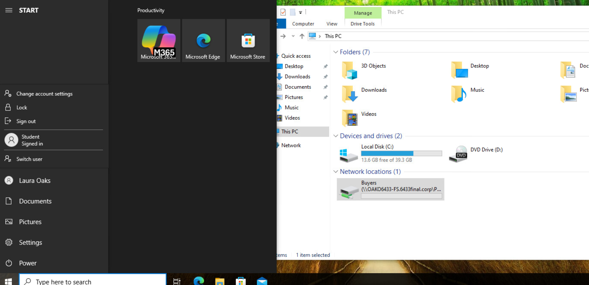
*Verification on CL1 — `gpresult /r` showing the applied GPOs, and the X: drive populated.*

That's the system enforcing the rules, not the user remembering them.

---

## Skills I'm demonstrating in this repo

**Active Directory** — forest install, DC promotion, secondary DC for redundancy, AD-integrated DNS with mutual-DNS configuration between DCs, OU structure design (function-first), AGDLP group nesting, separation of admin accounts.

**DHCP** — scope creation with the correct option set (gateway, DNS, domain suffix), authorisation in AD, conversion of a static client to DHCP for validation.

**DNS** — primary and reverse zones, A and PTR records, CNAME alias creation, mutual-resolver configuration across two DCs.

**File services** — share creation with SMB encryption, the "share permissions wide / NTFS narrow" pattern, the CREATOR OWNER trick for per-file write-back, inheritance disabled at the right level, Domain Admins explicitly preserved for ops.

**Group Policy** — drive-mapping preferences with item-level targeting on a security group, OU linkage, verification via `gpresult /r`.

**Troubleshooting reasoning** — included throughout: why DNS must be set before domain join, why CREATOR OWNER beats group-level Modify, why the two-layer share/NTFS pattern matters, why DHCP option 15 is non-negotiable on a domain client.

---

## What's in this repo

```
windows-ad-infrastructure-lab/
├── README.md           ← you are here (the case scenario + walk-through)
├── .gitignore
└── screenshots/        ← 25 captured screenshots from the build
```

The 25 screenshots above are every milestone of the build, named in build order. Each one was captured against a live VM running on the vSphere cluster — no diagrams, no mock-ups.

---

## My companion projects

| Repo | What's in it |
|---|---|
| [**qvis-network-portfolio**](https://github.com/) | A complete small-business multi-VLAN network in Cisco Packet Tracer with a four-part video walkthrough |
| [**qvis-aws-portfolio**](https://github.com/) | AWS cloud architecture for the QVIS Quick Vehicle Insurance System (Lagos State MVAA) |
| [**web-infrastructure-iis-nginx-sql-lab**](https://github.com/) | Companion lab — IIS on Windows Server, NGINX on Rocky Linux, SQL Server, Hyper-V with a nested Rocky VM |

---


